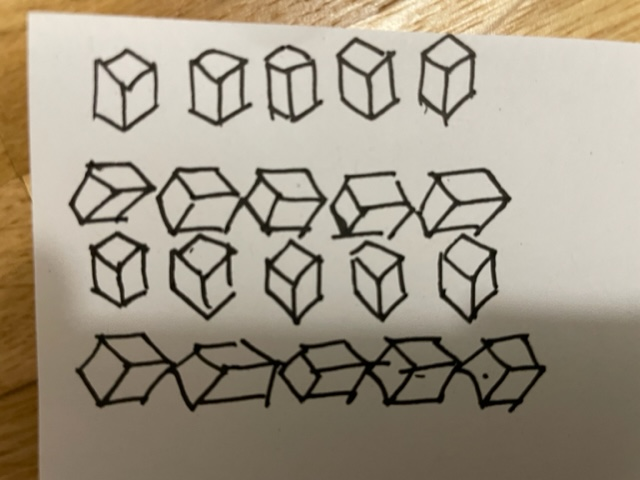
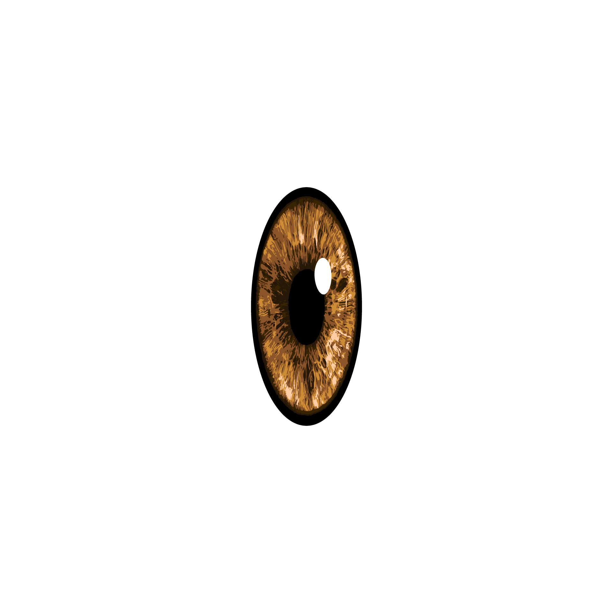

# Day 02

## Grids & Iterative Patterns

On day two of our course we had to design some kind of tiling pattern or textural composition. I had already once made a grid in a cube for another project in 3D. I really liked that one and I thought it would be fun to adapt the idea for this task. It should be something like cubes in a grid, that rotate in some way.

## Grid with boxes

First I strugled quite a while with the problem how to position the grid in the room and the right camera postition.


<iframe src="content\day02\grid_v1\index.html" width="100%" height="450" frameborder="no"></iframe>


After solving that problem I made the boxes transparent, gave them a color and let them rotate. Additionally I put a sphere in each box.


<iframe src="content\day02\grid_v2_spheres\index.html" width="100%" height="450" frameborder="no"></iframe>


After playing around for some time I had the idea, that it would be fun, if the spheres would be eyes. Some researching helped me to create a texture for an iris. For the white eyeball I just stuck a second sphere into the first. To bring the eyes to life I let them rotate as if they were looking around.


<iframe src="content\day02\grid_v3_eyes\index.html" width="100%" height="450" frameborder="no"></iframe>


While discussing the result with some friends, one of them suggested, that it would be cool if every eye looked in an other direction. Some more coding led to the result of every eye disturbingly looking around in its box and ,to top it off, having some kind of nervous twitching. Im really happy with what I achived. :D


<iframe src="content\day02\grid_v4_twitching\index.html" width="100%" height="450" frameborder="no"></iframe>
