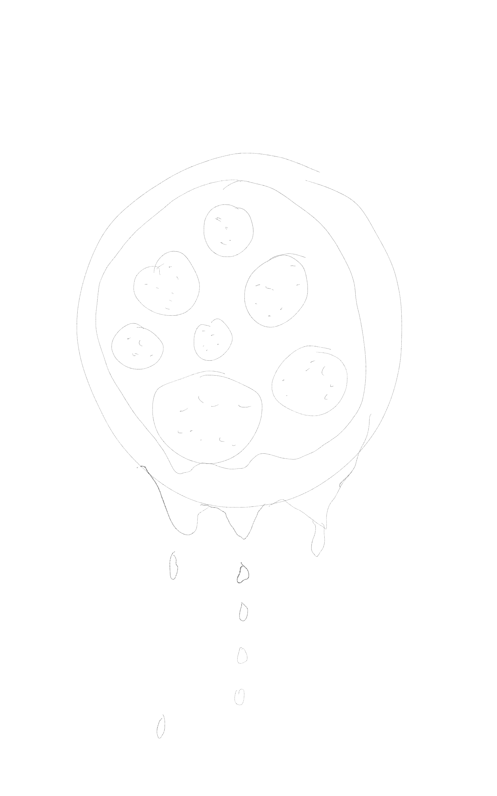
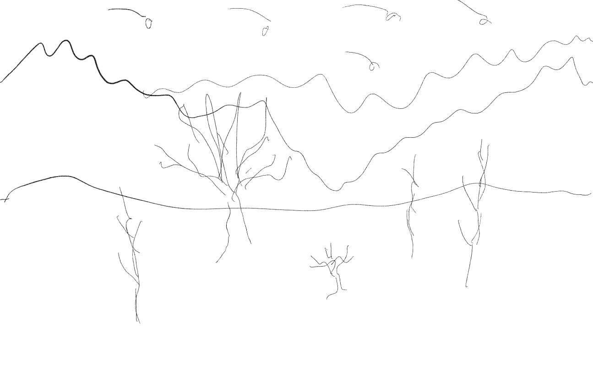

# Day 03

## Clock

Today we worked on building a device visualising the passing of time. It should be somewhat abstract without digits and should show a kind of cycle. So I did some brainstorming with some weird ideas like a Dalí pizza.

Inspired by the idea of a landscape with growing trees and stars doing their cycle in the sky, I decided to do a space flight. While flying there should be stars that are passed in a second, comets that are passed in a minute and planets that are passed in an hour. Easier said than done.

## Space flight

I had a snipped lying around that was already doing something similar just with stars, but not timed. I managed to implement a comet for, but couldn't bring it to fly in a minute to the edge of the canvas and to reappear. In the evening I gave up to priorize another idea.


<iframe src="content\day03\space_v2_comet\index.html" width="100%" height="450" frameborder="no"></iframe>


## Grid again

In order to have a working clock by the end of the week I adapted my grid with boxes from the day before again. To visualize the seconds the boxes turn transparent on after another. When there are 60 transparent boxes the hole thing resets and starts again. That was what I was able to achive so far and I would continue to work on it on an other day.


<iframe src="content\day03\time_v1\index.html" width="100%" height="450" frameborder="no"></iframe>
