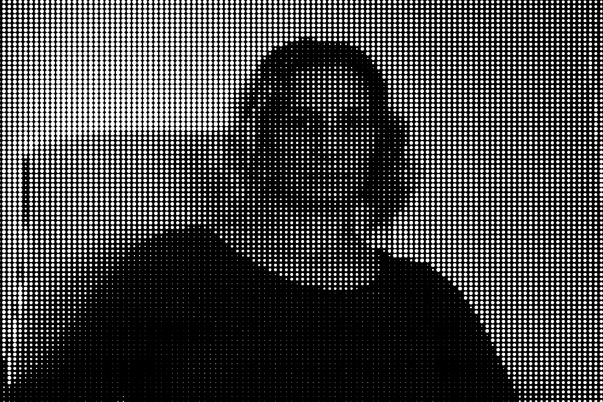

# Day 06

## Face Generator

The task for today was: "Create a program that is generating a parametric face. Your face should at least be controlled by 3 parameters but preferably more." Soon I found an idea from Daniel Shiffman for how to get pixels from an image. In his example he draws diffrent chars as pixels according to their shade.


<iframe src="content\day06\faces_v1_ascii\index.html" width="100%" height="450" frameborder="no"></iframe>


I adapted this idea and placed circles instead of chars.


<iframe src="content\day06\faces_v2_circles\index.html" width="100%" height="450" frameborder="no"></iframe>


To take it further I replaced a single image with a stream from the camera. Like that I was able to put a live stream into a pixelated video.

For the last challange I draged the image version into 3D space.


<iframe src="content\day06\faces_v5_3D\index.html" width="100%" height="450" frameborder="no"></iframe>

[Full screen](content/day06/faces_v5_3D)