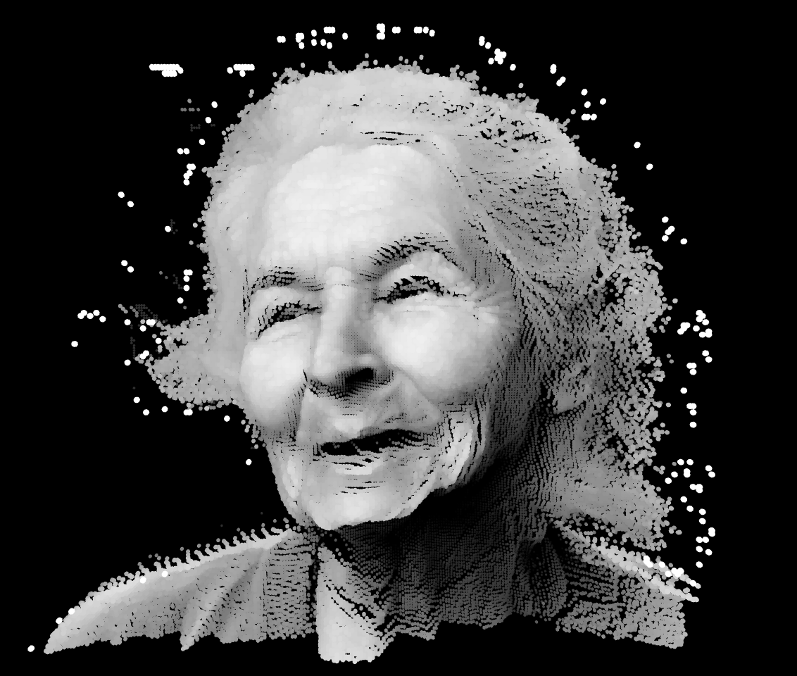

# Day 08

## Consolidation

Today we were free to consolidate one or more of the previous projects. I still liked working on the pixel faces in 3D, so I was going with this.
I was wondering what result I would get, if I used an other method to get the shade of a pixel. Before I calculated it from the RGB parts of the color. Now I put the hole project into HSB to get the brightness. For me this works better because it feels more plastic.

[Full screen](content/day08/faces_v11_3D_diameter)

For a better result I had, after getting the brightness, to put the colorMode back to RGB.

[Full screen](content/day08/faces_v10_3D_brightness)


<iframe src="content\day08\faces_v12_3D_twoFace\index.html" width="100%" height="450" frameborder="no"></iframe>

[Full screen](content/day08/faces_v12_3D_twoFace)


<iframe src="content\day08\faces_v13_3D_twoFace\index.html" width="100%" height="450" frameborder="no"></iframe>

[Full screen](content/day08/aces_v13_3D_twoFace)