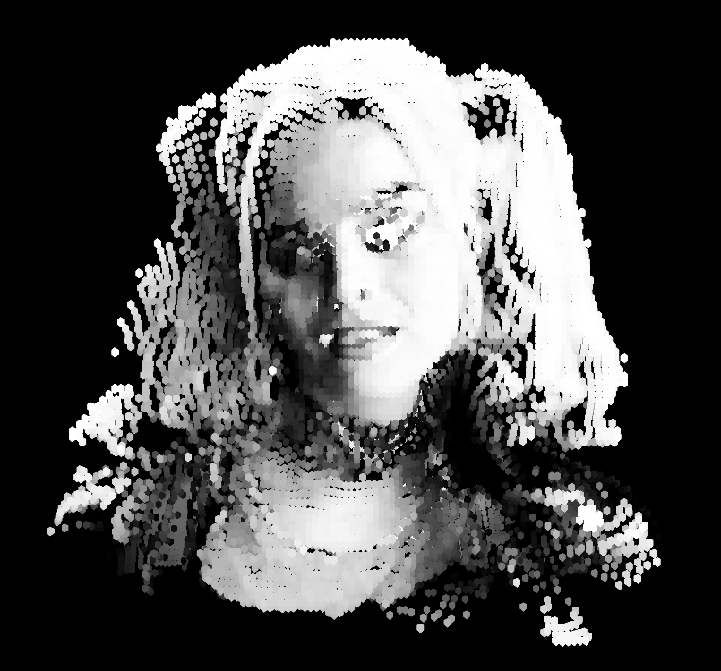
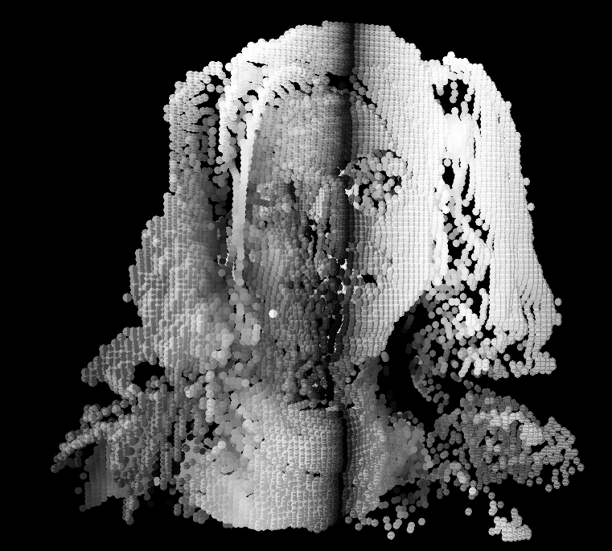

# Day 08

## Consolidation

Today we were free to consolidate one or more of the previous projects. I still liked working on the pixel faces in 3D, so I was going with this.
I was wondering what result I would get, if I used an other method to get the shade of a pixel. Before I calculated it from the RGB parts of the color. Now I put the hole project into HSB to get the brightness. For me this works better because it feels more plastic.

[Full screen](content/day08/faces_v11_3D_diameter)

For a better result I had, after getting the brightness, to put the colorMode back to RGB.

[Full screen](content/day08/faces_v10_3D_brightness)

Now I came up the idea to do something like a twoFace where two portraits are put back to back. The camera is rotating around.

To finish this up I tryed to let the portait that turns to the back fade away and the other to fade in. I managed to implement some kind of transparent cycle, but the timing is still off.

