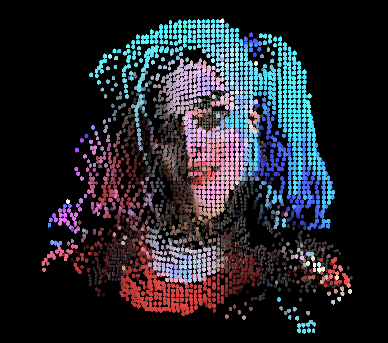

# Day 10

## Presentation day

This was the last day of the course and we all had the presentation of our projects. It's interesting to see what everyone of us achived and some of the projects could come in handy in the future.

## Post processing

Shortly after my own presentation I got an idea of how to calculate the transparency of my 3D project properly. So I took on working on it again.

It worked fine, so I desided to add colors to finish it off.

