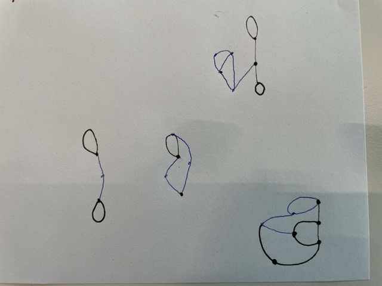
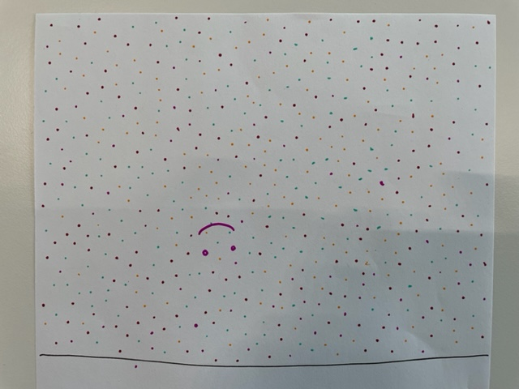
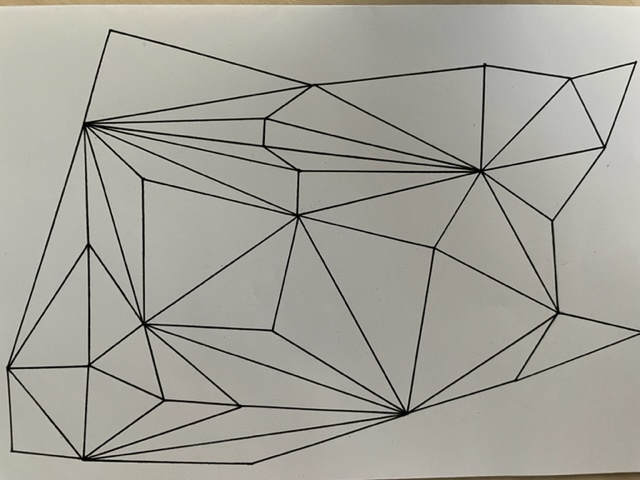

# Day 01 

## Intro

To start this course I learned about how to work together, which tools we will use and what the criterias are to pass at the end of the two weeks. For inspiration I got to know a big list of artists of generative graphic and design, which was really cool.

## Computing without computer

Our first task was to draw on paper regarding some simple rules. As examples we saw Wall drawing 118 from Sol Lewitt, Sprouts from John H. Conway & Michael S. Patternson and The beach from Moniker.
First I tried to play Sprouts with a friend. Soon I figured that I had to think ahead for about three move to not lose the game. 

Then I did The Beach with two other friends. It was surprisingly fun to draw the dots and we did it for quite some time. While drawing I could observe, that not all of us have the same feeling about the distance to other points.

The last thing I tried was graphic with lines inspired by Wall drawing 118, but I applied my own rules.

## GitHub

After lunch we got started with GitHub, which was frustrating tricky. I had to fork the repository from our course and clone it to my local client. Somehow I got it working. :)

## Computing with computer

The last task for today was to draw a simple thing on paper and try to write the code for it afterwards. I decided to go with a boat.


<iframe src="content\day01\02\index.html" width="100%" height="450" frameborder="no"></iframe>
